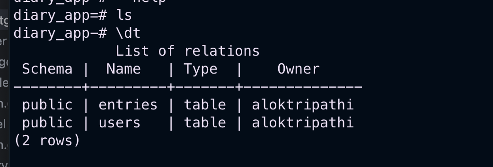
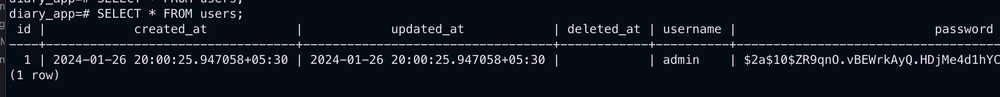

## Postgres commands

### Pre-requisite 

- Install `Postgres` using homebrew
- Install `psql` which is interface to Postgress.

### Run Postgres Service using brew 
- Start service : `brew services start postgresql@15`
- Stop service : `brew services stop postgresql@15`

### Commands
- connect to database : `psql -U aloktripathi -d diary_app`
- Switch to another database : `\c postgres`` (inside prompt)
- Drop the database : `DROP DATABASE your_database;`
- Exit from the prompt : `\q`
- List the database : `psql -l`

#### Creating DB command 
>`createdb -h <DB_HOSTNAME> -p <DB_PORT> -U <DB_USER> diary_app --password`

Example :

>`createdb -h localhost -p 5432 -U aloktripathi diary_app --password`

#### View the content Inside Schema
1.  Login : `psql -U your_username -d your_database_name -h your_host`
2. type `\dt`
3. Run query `SELECT * FROM table_name;`
4. Press `\q` to quit from the terminal 

**Examples**

